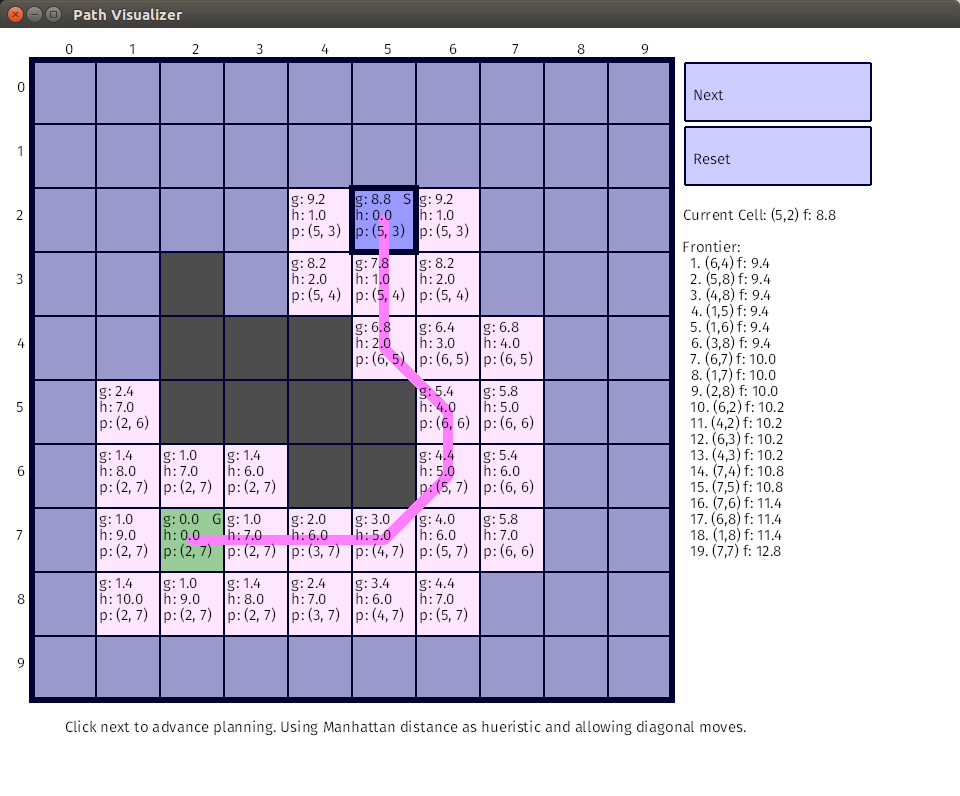

Path Visualizer
===============

A Rust GUI (using Piston) to explore how the A\* algorithm behaves.

Features
--------

* Graphical 2-D A\* implementation
* Customize maps to explore behavior
* Selectable heuristic for distance to goal
* Runs on Windows, Linux, and OSX

Screenshot
----------

# 

Caveats
-------

This is my first "real" Rust project so the code organization, style, and
general implementation probably should not be considered best practice. If you
have any comments on how to improve the software feel free to send them my way!
That said, I don't plan to actively maintain the project so tickets will likely
go unanswered for a long time.

Thanks
------

Thanks to the @PistonDevelopers team. This software wouldn't have been possible
without the library or the "Sudoku" tutorial which got me started on the GUI
portion.
